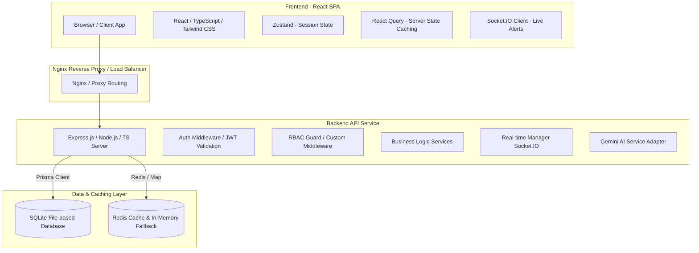
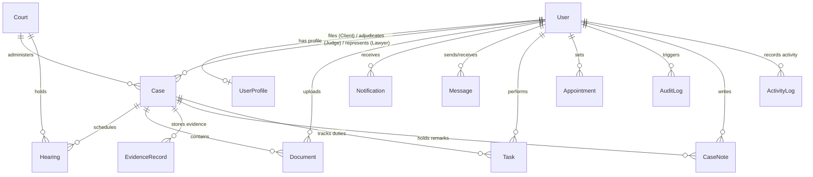

# 🏛️ E-Case Management System - Digital India Initiative

Transforming legal processes through cutting-edge technology. Empowering judiciary with digital workflow solutions.

[](https://opensource.org/licenses/MIT)
[](https://tailwindcss.com)
[](https://react.dev)
[](https://www.typescriptlang.org/)
[](https://www.prisma.io/)

A modern, enterprise-grade Judicial Management Platform built to replace legacy server-rendered architectures with a high-fidelity, type-safe Single Page Application (React) and a scalable REST/WebSocket API (Node.js/Express).

---

## 🏗️ System Architecture

The application is structured as a modern monorepo with decoupled frontend and backend layers:



---

## 🗄️ Database Design (Entity Relationship Diagram)

The underlying schema models complex judicial relationships, supporting full Role-Based Access Controls (RBAC), auditing trails, and task delegations:



---

## ✨ Features

### 🛡️ Role-Based Access Control (RBAC)
- **Super Admin & Court Admin**: Full control over user registers, account activation status, system configurations, and complete cryptographic audit trails.
- **Judge**: Case status updates, docket scheduling, document review, digital signing, and AI case summaries.
- **Lawyer**: Filing claims, reviewing dockets, client consultations room, uploading pleadings/evidence, and signing documents.
- **Client**: Case status updates, viewing timelines, uploading personal evidence, and text consultations.

### ⚙️ Core Functionality
- **Case Registries & Timeline**: Auto-generated case numbers (`ECMS-YYYY-XXXX`) and chronological event aggregator.
- **Conflict-Safe Hearings Docket**: Prevents concurrent schedules for the same judge within a 1-hour window. Month-by-month calendar view.
- **Documents & Signature Engine**: Multipart secure uploads, status workflow (Pending, Approved, Rejected), and digital signing hash logs.
- **Consultation Rooms**: Direct messaging channel over persistent WebSockets (Socket.IO) for real-time messaging, updates, and online presence tracking.
- **AI Judicial Assistant**: Powered by the Gemini API (`gemini-1.5-flash`) to compile case summaries and generate strategic legal insights. Includes a local fallback text synthesizer if the API key is not configured.
- **Personal Tasks & Notes Checklist**: In-dashboard and case-specific checklist widgets and official case notes logs.

---

## 🛠️ Setup & Installation

### Prerequisities
- Node.js (v18+)
- npm (v9+)
- Docker & Docker Compose (Optional)

### Step 1: Environment Configuration
Create a `.env` file in the `backend/` directory:
```env
PORT=5000
DATABASE_URL="file:./dev.db"
JWT_ACCESS_SECRET="your-super-secret-access-key-goes-here-make-it-long"
JWT_REFRESH_SECRET="your-super-secret-refresh-key-goes-here"
GEMINI_API_KEY="your-gemini-api-key"
NODE_ENV=development
```

### Step 2: Database Initialization
Install dependencies, generate Prisma models, and seed the SQLite database:
```bash
cd backend
npm install
npx prisma generate
npx prisma db push
npm run prisma:seed
```

### Step 3: Launch Services

#### Development Mode:
Start the backend dev server (auto-reloads on edits):
```bash
cd backend
npm run dev
```

In another terminal, start the frontend Vite server:
```bash
cd ../frontend
npm install
npm run dev
```
Open `http://localhost:5173/` in your browser.

#### Production Mode (Docker):
Build and launch the complete stack containing PostgreSQL, Redis, Backend REST/Socket server, and Nginx serving the React SPA:
```bash
docker-compose up --build
```

---

## 🧪 Testing
Run backend Jest tests:
```bash
cd backend
npm run test
```

## 🔒 Security Auditing Highlights
- Short-lived Access Tokens (stored in memory) and long-lived Refresh Tokens (stored in secure `HttpOnly`, `SameSite` cookies).
- Cryptographic Audit Trail logs for every user mutation, profile status change, and file submission.
- Fully parameter-bound queries via Prisma ORM to prevent SQL Injection.
- Clean file uploads validation logic (enforcing MIME extensions and 10MB limits).
